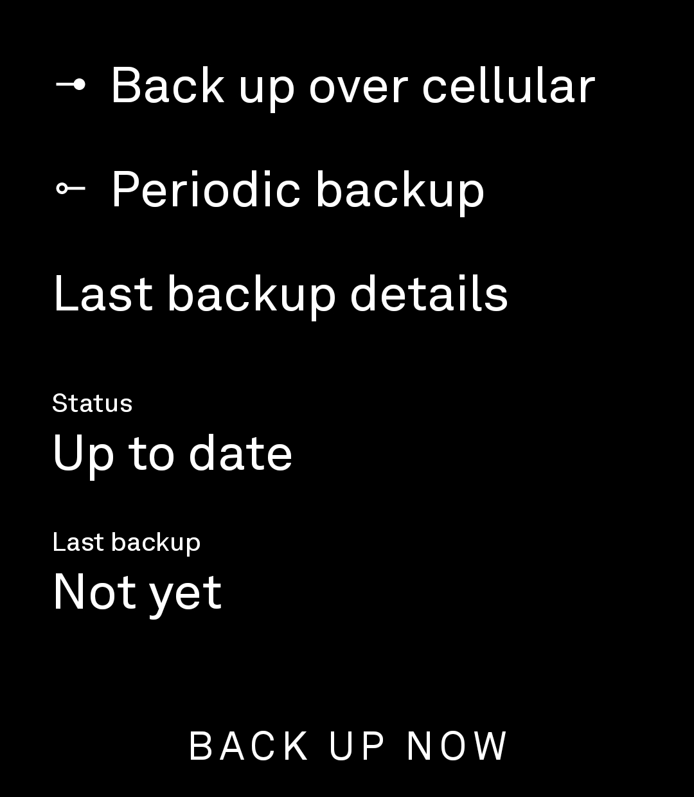
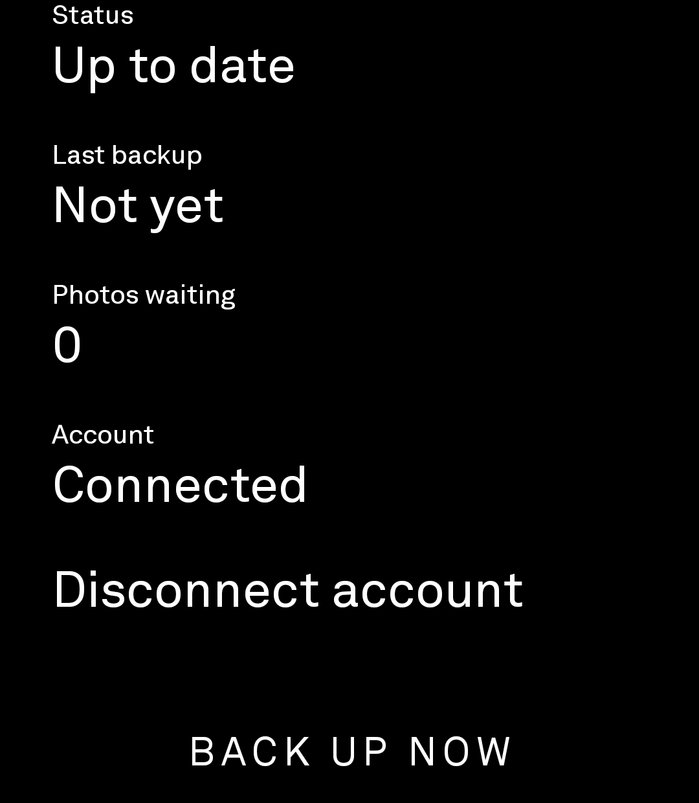
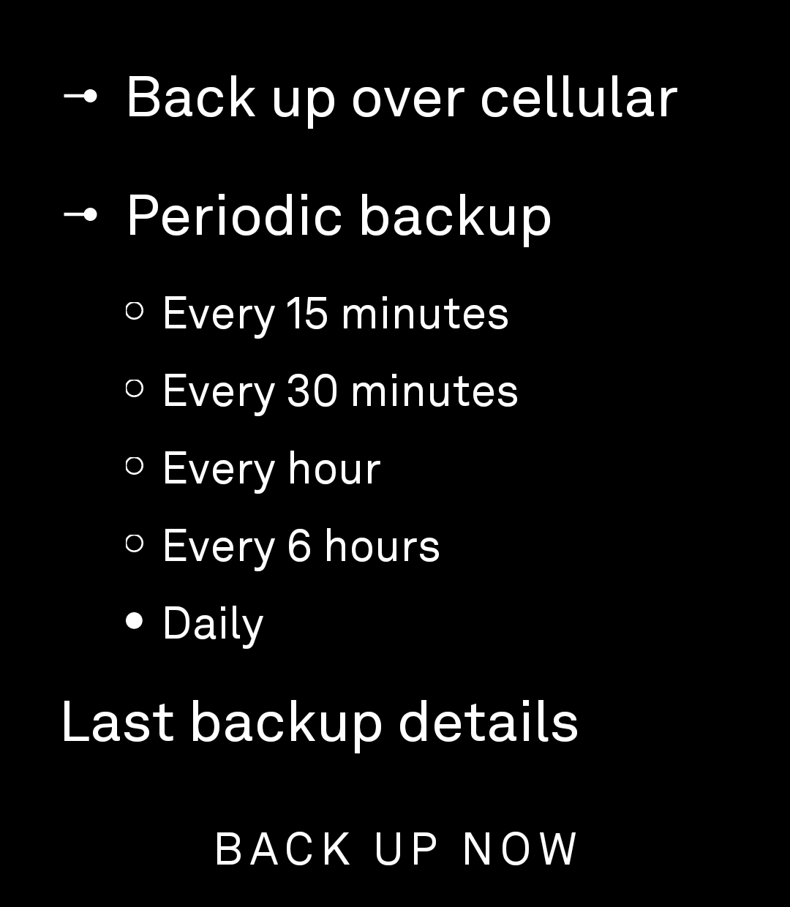

# Photo Backup

Photo Backup is a minimal, text-only Android application for Light Phone III that discovers eligible photos and appends them to the connected user's Google Photos library. It has no gallery, thumbnails, previews, downloads, deletion, or Google Photos browsing. It works without Google Play Services.

This repository contains two components:

- `android/`: the Light Phone application.
- `auth-server/`: a small TypeScript service that handles Google OAuth and issues short-lived access tokens to the phone.

The Android app cannot be used by itself. Each installation needs access to a configured auth server because Google web OAuth client secrets and refresh tokens must not be embedded in an APK.

## Before you begin

This is a self-hosted source project, not a universal APK download. Setting up your own copy means you will:

1. fork or clone this repository;
2. create a Google Cloud web OAuth client;
3. deploy the included auth server with persistent storage and your private secrets;
4. build the Android app with that server's HTTPS URL; and
5. install the APK and pair your Google account.

No photo is uploaded during compilation or automated testing. Real uploads begin only after the phone is paired and a backup runs.

## Current status

The complete flow is working on a Light Phone III:

- Browser-based Google account pairing works without Google Play Services.
- Existing and new images are discovered from `Pictures/Light/` and `Pictures/Screenshots/`.
- Manual and periodic backups upload to Google Photos.
- Room keeps a durable local ledger and prevents duplicate uploads.
- Periodic frequency can be set to 15 minutes, 30 minutes, 1 hour, 6 hours, or daily.
- Wi-Fi-only backup is the default; a persistent cellular setting and one-time cellular action are available.

The public source tree intentionally has no auth-server URL configured. A first build therefore opens in the safe **Server not configured** state. Each operator must deploy a server and set its URL in ignored `android/local.properties` before pairing or uploading.

## Screenshots

<p align="center">
  
  
  
</p>

## Privacy and upload policy

The app accepts supported images only within these MediaStore path trees:

```text
Pictures/Light/
Pictures/Screenshots/
```

Path matching is case-insensitive and accepts nested directories. Unrelated locations such as `DCIM/`, `Download/`, messaging folders, and other `Pictures/` subfolders are excluded. JPEG, PNG, HEIC/HEIF, and WebP are supported. Recently changed images must settle before becoming eligible.

The application:

- never displays photo content;
- never deletes or modifies local photos;
- never downloads, lists, updates, or deletes Google Photos media;
- never requests broad Android storage access;
- requests only Google's `photoslibrary.appendonly` OAuth scope;
- streams files rather than loading entire photos into memory.

Duplicate prevention uses `(MediaStore volume, MediaStore ID)` as the primary identity and a streaming SHA-256 content fingerprint as a secondary identity. A record becomes `UPLOADED` only after Google Photos confirms media-item creation.

## Architecture

### Android application

The app uses Kotlin, Jetpack Compose, Room, WorkManager, DataStore, coroutines, and OkHttp. Its application ID is `com.stan.lightphotobackup`, minimum API is 26, and target API is 34.

- MediaStore discovers eligible images across external volumes.
- Room records discovery, upload state, attempts, and Google media-item IDs.
- WorkManager coordinates one unique manual job and one unique periodic job.
- DataStore persists cellular, periodic, and frequency preferences.
- Android Keystore-backed AES-GCM protects the device credential.
- A LightOS-inspired UI uses a dependency-minimized, MIT-licensed subset of the Light SDK UI primitives.

Periodic work survives closing the app and phone reboots. Its interval is approximate rather than an exact alarm. Android may delay it until network and battery constraints are satisfied. Force-stopping the app suspends background work until the app is opened again.

### Authentication server

The TypeScript/Express server owns the Google web OAuth client secret and encrypted refresh tokens. The phone stores a random, revocable device credential and receives only short-lived Google access tokens.

Pairing uses expiring codes, CSRF state, PKCE, and a one-time OAuth-start token. Refresh tokens are encrypted with AES-256-GCM. Production requires HTTPS, a stable 32-byte encryption key, and persistent database storage.

## Complete setup

### 1. Install prerequisites

You need:

- a fork or clone of this repository;
- Node.js 20–22 and npm;
- Android Studio or an Android SDK with JDK 17 or 21;
- ADB access to the Light Phone III;
- a Google account and Google Cloud project;
- an HTTPS host for the auth server. Railway is documented here, but another persistent Node host can be used.

Clone the repository:

```bash
git clone https://github.com/sjkornelsen/light-photo-backup-public.git
cd light-photo-backup-public
```

### 2. Configure Google Cloud

1. Create or choose a Google Cloud project.
2. Enable the Google Photos Library API.
3. Configure the OAuth consent screen.
4. For personal use, keep the application in Testing when appropriate and add every allowed Google account as a test user.
5. Create an OAuth client of type **Web application**.
6. Keep the client ID and client secret for the auth server.
7. After assigning the server's HTTPS domain, add this exact authorized redirect URI:

```text
https://YOUR_SERVER/oauth/google/callback
```

Do not create an Android OAuth client for this flow and never place the web client secret in the Android project. See [Google OAuth setup](docs/GOOGLE_SETUP.md) for more detail.

### 3. Deploy the auth server to Railway

1. Create a Railway project from your fork or repository. Keep any customized fork private if you plan to store private operational notes there, but never commit secrets even to a private repository.
2. Set the service root directory to `auth-server`.
3. Set the build command to `npm ci && npm run build`.
4. Set the start command to `npm start`.
5. Add a persistent volume mounted at `/data`.
6. Generate an HTTPS Railway domain.
7. Configure these variables:

```text
NODE_ENV=production
PUBLIC_BASE_URL=https://YOUR_SERVER
GOOGLE_CLIENT_ID=YOUR_WEB_CLIENT_ID
GOOGLE_CLIENT_SECRET=YOUR_WEB_CLIENT_SECRET
TOKEN_ENCRYPTION_KEY_BASE64=BASE64_ENCODED_32_BYTE_KEY
DATABASE_PATH=/data/photo-backup.sqlite
PAIRING_TTL_SECONDS=600
PAIRING_POLL_INTERVAL_SECONDS=5
DEVICE_TOKEN_TTL_DAYS=365
TRUST_PROXY=true
```

Generate the encryption key locally with:

```bash
openssl rand -base64 32
```

Store that value only in Railway's secret variables and a separate secure backup. Do not rotate it while encrypted refresh tokens exist. Losing it makes those tokens unreadable.

Add `https://YOUR_SERVER/oauth/google/callback` to the Google web client, deploy, then verify:

```bash
curl https://YOUR_SERVER/health
```

The response should be `{"status":"ok"}`. Full Railway instructions and persistence warnings are in [DEPLOY_RAILWAY.md](auth-server/DEPLOY_RAILWAY.md).

### 4. Configure and build Android

Create `android/local.properties`. This file is ignored by Git:

```text
sdk.dir=/absolute/path/to/your/Android/sdk
PHOTO_BACKUP_AUTH_SERVER_URL=https://YOUR_SERVER
```

Build and test:

```bash
cd android
./gradlew testDebugUnitTest assembleDebug
```

From the repository root, the debug APK is created at:

```text
android/app/build/outputs/apk/debug/app-debug.apk
```

Install it without clearing existing app data:

```bash
adb devices
adb install -r app/build/outputs/apk/debug/app-debug.apk
```

The install command above assumes your terminal is still inside `android/`.

The update will succeed only when the installed application was signed with the same key. Do not uninstall casually: uninstalling erases the local backup ledger and device credential.

For optional USB-local server development, use `http://127.0.0.1:8787` in `local.properties` and run:

```bash
adb reverse tcp:8787 tcp:8787
```

Normal hosted use is HTTPS and does not need ADB forwarding.

### 5. Pair the phone

1. Open Photo Backup and grant full photo access. Android's selected-photo-only permission is insufficient for automatic backup.
2. Choose **Connect account**.
3. On another device, open the displayed verification URL.
4. Enter the pairing code shown on the phone.
5. Continue to Google and authorize the configured test/user account.
6. Return to the phone and wait for the connected state.
7. Choose **BACK UP NOW** for the first backup.

The phone never receives the Google refresh token. It receives a random server credential and uses it to request short-lived access tokens.

## Using Photo Backup

- **Back up over cellular** controls the persistent network policy.
- **Back up over cellular now** permits cellular only for that manual run.
- **Periodic backup** enables background WorkManager scheduling.
- Frequency choices are minimum intervals; LightOS and Android may run later.
- **Last backup details** shows counts, last scan, last error, and non-sensitive diagnostics.
- **Disconnect account** invalidates the device credential and removes server-held token material.

Useful logs:

```bash
adb logcat | grep -iE "PhotoBackup|PhotoBackupWorker|PhotoBackupAuth|PhotoBackupUpload"
```

## Local auth-server development

```bash
cd auth-server
cp .env.example .env
# Add your own Google credentials and encryption key to .env.
npm install
npm test
npm run dev
```

Never commit `.env`, encryption keys, Google credentials, SQLite databases, Android `local.properties`, signing keys, build outputs, or tokens.

## APK distribution and signing

The repository does not currently publish a generally supported release APK. Local debug APKs are signed with a developer debug key and are appropriate for development or a single controlled device, not durable public distribution.

A proper downloadable release requires:

1. a private release keystore and strong passwords;
2. a stable, backed-up signing key used for every future update;
3. secure CI or local signing configuration that never commits the key or passwords;
4. a version-code/version-name policy;
5. a decision about which auth-server URL is compiled into the APK;
6. a GitHub tag/release to hold the signed APK and checksums.

Because device credentials are server-specific, an APK tied to one auth server is useful only to users accepted by that server's Google OAuth configuration. Independent operators should build against their own server.

## Additional documentation

- [Google OAuth setup](docs/GOOGLE_SETUP.md)
- [Railway deployment](auth-server/DEPLOY_RAILWAY.md)
- [General server deployment](docs/SERVER_DEPLOYMENT.md)
- [Light Phone device testing](docs/DEVICE_TESTING.md)
- [Security model](docs/SECURITY.md)

## Limitations

- WorkManager scheduling is inexact, and LightOS may impose additional background restrictions.
- Full image access is required to monitor both supported folders.
- The Railway SQLite design is intended for a personal, single-instance deployment, not horizontal scaling.
- Losing the SQLite volume loses device and refresh-token records.
- Losing or rotating `TOKEN_ENCRYPTION_KEY_BASE64` makes stored refresh tokens unreadable.
- Losing the Android signing key prevents seamless application updates.
- Google Photos API behavior, quotas, and OAuth testing or verification requirements can change.
